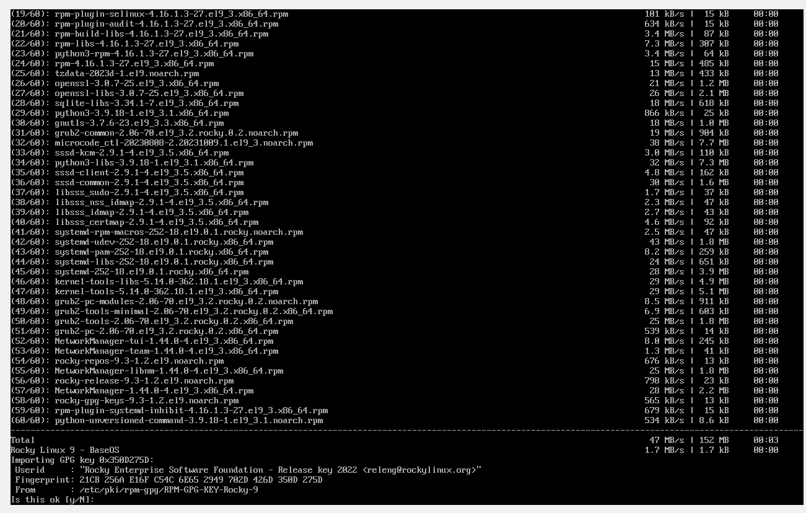
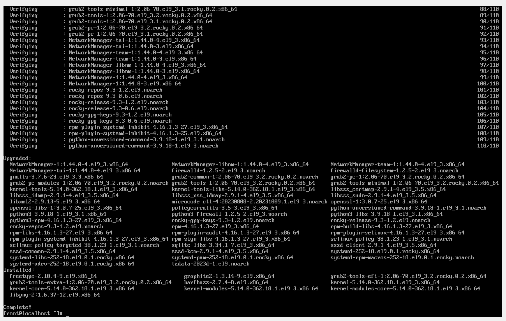
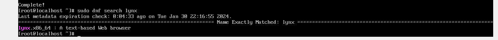
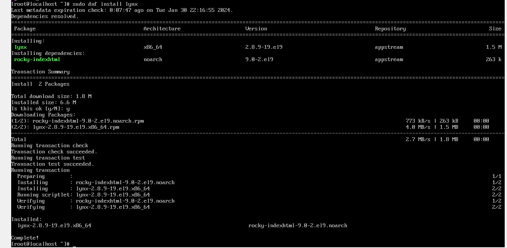
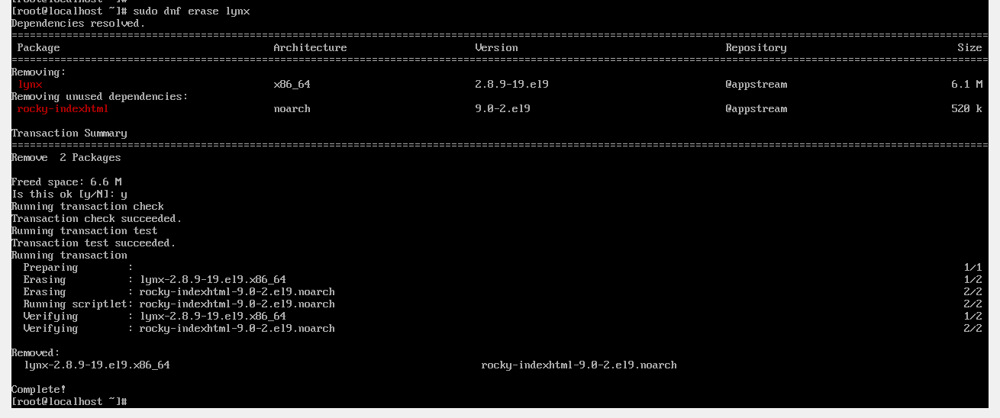

# Gestión de Paquetes en Rocky Linux

1. **Actualizar el sistema:**
    ```bash
    sudo dnf update
    ```

    
    
   

3. **Buscar paquetes:**
    ```bash
    sudo dnf search el_paquete
    ```
   

4. **Instalar un paquete:**
    ```bash
    sudo dnf install el_paquete
    ```
     
    
  
5. **Comprobar si el paquete está instalado:**
    ```bash
    rpm -q el_paquete
    ```
    
    
6. **Comprobar más información sobre el paquete:**
    ```bash
    rpm -ql el_paquete
    ```
     

7. **Desinstalar el paquete:**
    ```bash
    sudo dnf erase el_paquete
    # O
    sudo dnf remove el_paquete
    ```

    


    
## LICENCIA

